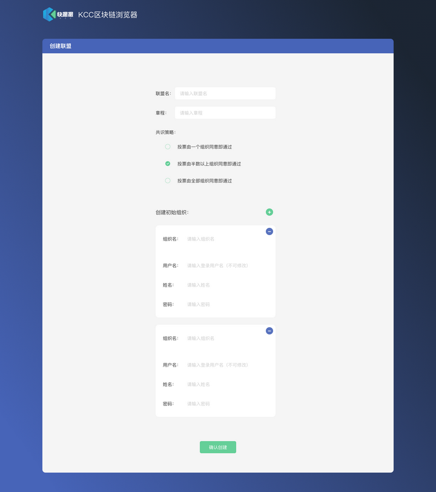
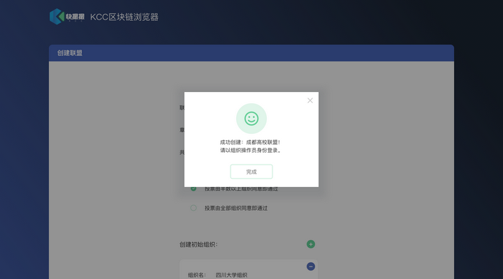
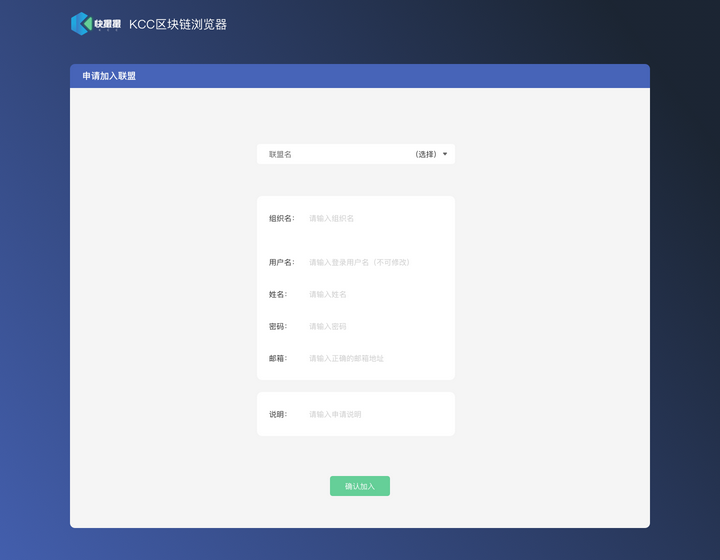
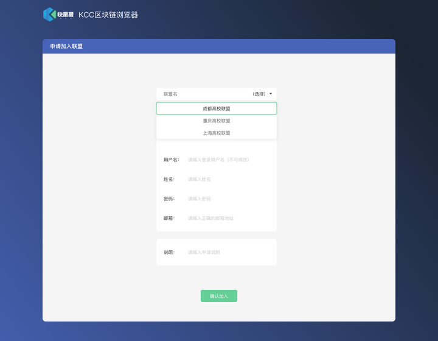
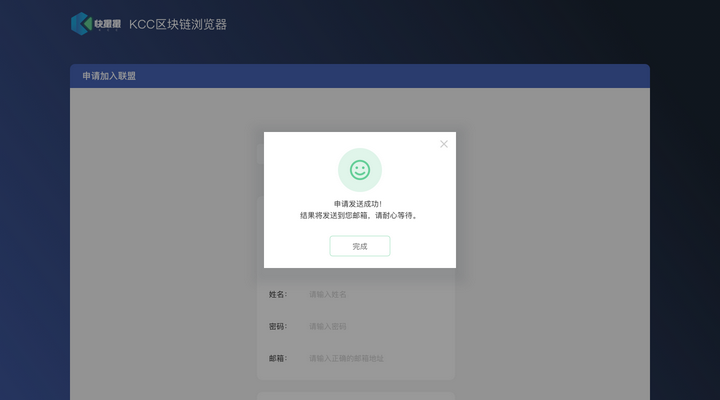

## 环境变量

HostName: 192.168.1.6:8080

------

## ui001 - 创建联盟

FEGovernancePanelService-CreateGovernancePanel
方法: POST
路径: http://{{HostName}}/fe-panel-service/FEGovernancePanelService/CreateGovernancePanel
请求示例(json): {
					"login_id":"xx",
					"login_password":"1234"
				}	
				
响应示例(json): {
				    	"code":100,
					"message":"success"
				}
				

FEGovernancePanelService-ListAllConsistencePolicys
方法: GET
路径: http://{{HostName}}/fe-panel-service/FEGovernancePanelService/ListAllConsistencePolicys
请求示例(json): {
					"login_id":"xx",
					"login_password":"1234"
				}	
				
响应示例(json): {
				    	"code":100,
					"message":"success"
				}
				

## ui002 - 创建成功

## ui003 - 登录

FEOperatorService-OperatorLogin
方法: POST
路径: http://{{HostName}}/fe-panel-service/FEOperatorService/OperatorLogin
请求示例(json): {
					"login_id":"xx",
					"login_password":"1234"
				}	
				
响应示例(json): {
				    	"code":100,
					"message":"success"
				}
				

## ui004 - 申请加入

FEApplyService-ApplyJoinPanel
方法: POST
路径: http://{{HostName}}/fe-panel-service/FEApplyService/ApplyJoinPanel
请求示例(json): {
					"login_id":"xx",
					"login_password":"1234"
				}	
				
响应示例(json): {
				    	"code":100,
					"message":"success"
				}
				

## ui005 - 申请加入交互

FEGovernancePanelService-ListAllConsistencePolicys
方法: GET
路径: http://{{HostName}}/fe-panel-service/FEGovernancePanelService/ListAllConsistencePolicys
请求示例(json): {
					"login_id":"xx",
					"login_password":"1234"
				}	
				
响应示例(json): {
				    	"code":100,
					"message":"success"
				}
				

## ui006 - 申请成功

